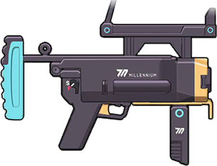

<h1 align="center">
  

  
  

</h1>

    

    

  <picture>
    <source
      srcset="https://github-readme-stats.vercel.app/api?username=HanaokaYuzu&theme=dark&show_icons=true&hide_border=true&count_private=true"
      media="(prefers-color-scheme: dark)"
    />
    <source
      srcset="https://github-readme-stats.vercel.app/api?username=HanaokaYuzu&theme=vue&show_icons=true&hide_border=true&count_private=true"
      media="(prefers-color-scheme: light), (prefers-color-scheme: no-preference)"
    />
    
  </picture>
  <picture>
    <source
      srcset="https://git-hub-streak-stats.vercel.app/?user=HanaokaYuzu&theme=dark&hide_border=true"
      media="(prefers-color-scheme: dark)"
    />
    <source
      srcset="https://git-hub-streak-stats.vercel.app/?user=HanaokaYuzu&theme=vue&hide_border=true"
      media="(prefers-color-scheme: light), (prefers-color-scheme: no-preference)"
    />
    
  </picture>

