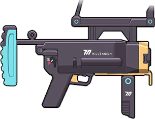

<h1 align="center">
  

  
  

</h1>

    

    

  <picture>
    <source
      srcset="https://ghstats.dev/api/card?username=hanaokayuzu&hide_border=true&hide=hours%2Cweek%2Ctrend%2Cavg%2Cactive_day%2Cissues%2Cstreak%2Cgrade%2Crepos%2Cprs"
      media="(prefers-color-scheme: dark)"
    />
    <source
      srcset="https://ghstats.dev/api/card?username=hanaokayuzu&theme=light&hide_border=true&hide=hours%2Cweek%2Ctrend%2Cavg%2Cactive_day%2Cissues%2Cstreak%2Cgrade%2Crepos%2Cprs"
    />
    
  </picture>

